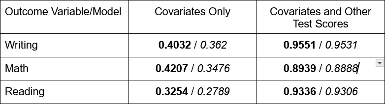

```{r, echo = FALSE}
knitr::opts_chunk$set(
  fig.width = 6,
  fig.asp = .6,
  out.width = "90%"
)
```

```{r, include = FALSE}
library(tidyverse)
library(gtsummary)
library(emulator)
```

```{r, include = FALSE}
set.seed(4)
test_df=read_csv('Project_1_data.csv') %>% janitor::clean_names() 

test_df=test_df %>%  
  mutate(is_first_child=case_when(
    is.na(is_first_child) &nr_siblings==0 ~ 'yes',
    TRUE ~is_first_child
  )) %>% 
        mutate(gender=as.factor(gender),
               ethnic_group=as.factor(ethnic_group),
               parent_educ=as.factor(parent_educ),
               lunch_type=as.factor(lunch_type),
               test_prep=as.factor(test_prep),
               parent_marital_status=as.factor(parent_marital_status),
               practice_sport=as.factor(practice_sport),
               is_first_child=as.factor(is_first_child),
               transport_means=as.factor(transport_means),
               wkly_study_hours=as.factor(wkly_study_hours)) %>% drop_na()
 
```


```{r, include = FALSE}
summary(test_df)

test_df %>% 
  ggplot(aes(x=math_score))+geom_histogram()
test_df %>% 
  ggplot(aes(x=reading_score))+geom_histogram()
test_df %>% 
  ggplot(aes(x=writing_score))+geom_histogram()
```

```{r, include = FALSE}

# Loop through pairs of columns and run the chi-square test

for (i in 1:(11 - 1)) {
  for (j in (i + 1):11) {
    # Get the two columns to test
    col1 <- test_df[[i]]
    col2 <- test_df[[j]]
    
    contingency_table <- table(col1, col2)
    
    # Perform the chi-square test
    chi_test <- chisq.test(contingency_table)
    
    #PRint the results 
    if(chi_test$p.value<.05){
      
      
      cat("Chi-square test for columns", colnames(test_df)[i], "and", colnames(test_df)[j], "\n")
    print(chi_test)
    

    }
    
  }
}

ggplot(test_df, aes(x = nr_siblings, fill = gender)) +
      geom_bar(position = "fill") +
      labs(y = "Proportion", title = "Pairwise Relationship")
ggplot(test_df, aes(x = nr_siblings, fill = is_first_child)) +
      geom_bar(position = "fill") +
      labs(y = "Proportion", title = "Pairwise Relationship")

```

## Table 1: Type A Model Coefficients

### Writing Score Model

```{r, include = FALSE}
set.seed(4)
df_4_mdl_write=test_df %>% dplyr::select(gender,ethnic_group,parent_educ,lunch_type,test_prep,parent_marital_status,practice_sport,is_first_child,transport_means,wkly_study_hours,writing_score)
full_fit_write=lm(writing_score ~ .^2,data=df_4_mdl_write) # includes interaction effects
```

```{r, include = FALSE}
set.seed(4)
stepwise_model_write <- step(full_fit_write, direction = "both", trace = 0)

```

```{r, echo = FALSE}
stepwise_model_write$coefficients %>% knitr::kable(col.names = c("Covariate", "Coefficient"))
```

The proper interpretation of these coefficients is as follows: Holding all other variables constant, one unit increase in [covariate] leads to [coefficient] units increase in the outcome of interest.
 
### Math Score Model

```{r, include = FALSE}
set.seed(4)
df_4_mdl_math=test_df %>% dplyr::select(gender,ethnic_group,parent_educ,lunch_type,test_prep,parent_marital_status,practice_sport,is_first_child,transport_means,wkly_study_hours,math_score)
full_fit_math=lm(math_score ~ .^2,data=df_4_mdl_math)
```

```{r, include = FALSE}
set.seed(4)
stepwise_model_math <- step(full_fit_math, direction = "both", trace = 0)
```

```{r, echo = FALSE}
stepwise_model_math$coefficients %>% knitr::kable(col.names = c("Covariate", "Coefficient"))
```

The proper interpretation of these coefficients is as follows: Holding all other variables constant, one unit increase in [covariate] leads to [coefficient] units increase in the outcome of interest.

### Reading Score Model

```{r, include = FALSE}
set.seed(4)
df_4_mdl_read=test_df %>% dplyr::select(gender,ethnic_group,parent_educ,lunch_type,test_prep,parent_marital_status,practice_sport,is_first_child,transport_means,wkly_study_hours,reading_score)
full_fit_read=lm(reading_score ~ .^2,data=df_4_mdl_read)
```

```{r, include = FALSE}
set.seed(4)
stepwise_model_read <- step(full_fit_read, direction = "both", trace = 0)
```

```{r, echo = FALSE}
stepwise_model_read$coefficients %>% knitr::kable(col.names = c("Covariate", "Coefficient"))
```

The proper interpretation of these coefficients is as follows: Holding all other variables constant, one unit increase in [covariate] leads to [coefficient] units increase in the outcome of interest.


### Table 2: Multiple and Adjusted $R^2$ for all models 



Multiple $R^2$ is bold, adjusted $R^2$ is italicized. 

```{r, include = FALSE}
set.seed(4)
df_4_mdl_write2=test_df %>% dplyr::select(gender,ethnic_group,parent_educ,lunch_type,test_prep,parent_marital_status,practice_sport,is_first_child,transport_means,wkly_study_hours,writing_score,math_score,reading_score)
full_fit_write2=lm(writing_score ~ .^2,data=df_4_mdl_write2)
```


```{r, include = FALSE}
set.seed(4)
stepwise_model_write2 <- step(full_fit_write2, direction = "both", trace = 0)
summary(stepwise_model_write2)
```

```{r, include = FALSE}
plot(stepwise_model_write2)
```


```{r, include = FALSE}
set.seed(4)
df_4_mdl_math2=test_df %>% dplyr::select(gender,ethnic_group,parent_educ,lunch_type,test_prep,parent_marital_status,practice_sport,is_first_child,transport_means,wkly_study_hours,math_score,writing_score,reading_score)
full_fit_math2=lm(math_score ~ .^2,data=df_4_mdl_math2)
```

```{r, include = FALSE}
set.seed(4)
stepwise_model_math2 <- step(full_fit_math2, direction = "both", trace = 0)
summary(stepwise_model_math2)
```

```{r, include = FALSE}
set.seed(4)
df_4_mdl_read2=test_df %>% dplyr::select(gender,ethnic_group,parent_educ,lunch_type,test_prep,parent_marital_status,practice_sport,is_first_child,transport_means,wkly_study_hours,reading_score,writing_score,math_score)
full_fit_read2=lm(reading_score ~ .^2,data=df_4_mdl_read2)
```

```{r, include = FALSE}
set.seed(4)
stepwise_model_read2 <- step(full_fit_read2, direction = "both", trace = 0)

summary(stepwise_model_read2)
```

```{r, include = FALSE}
plot(stepwise_model_math2)
```

## Table 3: Type B Model Coefficients

### Writing Score with Other Scores as Predictors 

```{r, echo = FALSE}
set.seed(4)
par(mfrow=c(2, 2))
writing_without_insig_interactions <- lm(writing_score ~ gender + ethnic_group + parent_educ +     lunch_type + test_prep + parent_marital_status + practice_sport +    is_first_child + transport_means + wkly_study_hours + reading_score + math_score + transport_means:reading_score + math_score:reading_score, data=df_4_mdl_read2)

writing_without_insig_interactions$coefficients %>% knitr::kable(col.names = c("Covariate", "Coefficient"))
```

The proper interpretation of these coefficients is as follows: Holding all other variables constant, one unit increase in [covariate] leads to [coefficient] units increase in the outcome of interest.


## Math Score with Other Scores as Predictors

```{r, echo = FALSE}
set.seed(4)
par(mfrow=c(2, 2))
math_without_insig_interactions <- lm(math_score ~ gender + ethnic_group + parent_educ +     lunch_type + test_prep + parent_marital_status + practice_sport +    is_first_child + transport_means + wkly_study_hours + reading_score + writing_score + lunch_type:is_first_child + test_prep:transport_means + wkly_study_hours:reading_score, data=df_4_mdl_read2)

math_without_insig_interactions$coefficients %>% knitr::kable(col.names = c("Covariate", "Coefficient"))
```

The proper interpretation of these coefficients is as follows: Holding all other variables constant, one unit increase in [covariate] leads to [coefficient] units increase in the outcome of interest.

## Reading Score with Other Scores as Predictors 

```{r, echo = FALSE}
set.seed(4)
par(mfrow=c(2, 2))
reading_without_insig_interactions <- lm(reading_score ~ gender + ethnic_group + parent_educ +     lunch_type + test_prep + parent_marital_status + practice_sport +    is_first_child + transport_means + wkly_study_hours + writing_score + math_score + is_first_child:transport_means + transport_means:writing_score, data=df_4_mdl_read2)

reading_without_insig_interactions$coefficients %>% knitr::kable(col.names = c("Covariate", "Coefficient"))
```

The proper interpretation of these coefficients is as follows: Holding all other variables constant, one unit increase in [covariate] leads to [coefficient] units increase in the outcome of interest.

## Explore Diagnostics for These Models

### Figure 1: Diagnostic plots for the Writing Type A Model

```{r, echo = FALSE}
par(mfrow = c(2, 2))
plot(stepwise_model_write) 
```


### Figure 2: Diagnostic plots for the Math Type A Model

```{r, echo = FALSE, warning = FALSE}
par(mfrow=c(2, 2))
plot(stepwise_model_math)
```


### Figure 3: Diagnostic plots for the Reading Type A Model


```{r, echo = FALSE}
par(mfrow=c(2, 2))
plot(stepwise_model_read)
```


### Figure 4: Diagnostic plots for the Writing Type B Model


```{r, echo = FALSE}
par(mfrow=c(2, 2))
plot(writing_without_insig_interactions)
```


### Figure 5: Diagnostic plots for the Math Type B Model


```{r, echo = FALSE}
par(mfrow=c(2, 2))
plot(math_without_insig_interactions)
```


### Figure 6: Diagnostic plots for the Reading Type B Model


```{r, echo = FALSE}
par(mfrow=c(2, 2))
plot(reading_without_insig_interactions)
```

