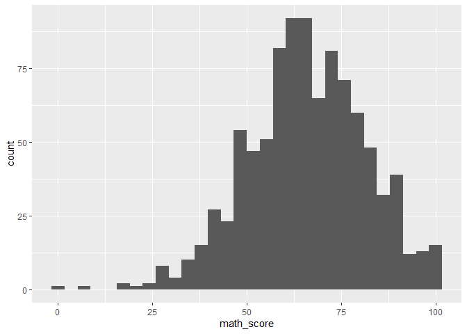
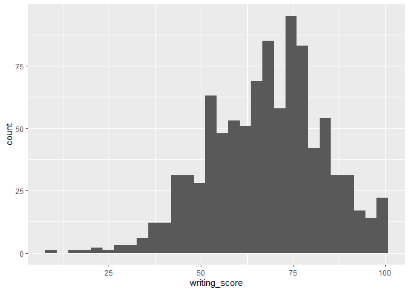
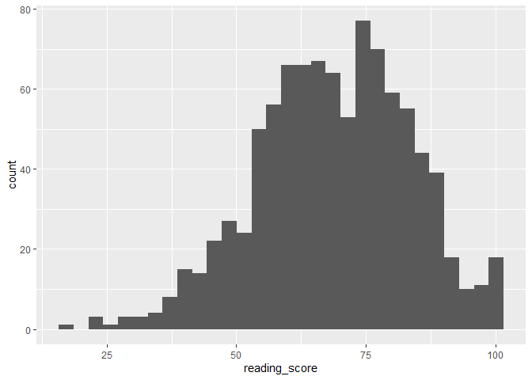
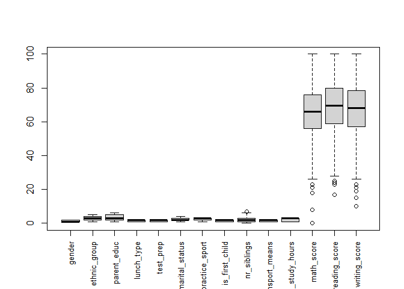

Mari’s Work
================

``` r
library(tidyverse)
```

    ## ── Attaching core tidyverse packages ──────────────────────── tidyverse 2.0.0 ──
    ## ✔ dplyr     1.1.4     ✔ readr     2.1.5
    ## ✔ forcats   1.0.0     ✔ stringr   1.5.1
    ## ✔ ggplot2   3.5.1     ✔ tibble    3.2.1
    ## ✔ lubridate 1.9.3     ✔ tidyr     1.3.1
    ## ✔ purrr     1.0.2     
    ## ── Conflicts ────────────────────────────────────────── tidyverse_conflicts() ──
    ## ✖ dplyr::filter() masks stats::filter()
    ## ✖ dplyr::lag()    masks stats::lag()
    ## ℹ Use the conflicted package (<http://conflicted.r-lib.org/>) to force all conflicts to become errors

``` r
library(GGally)
```

    ## Warning: package 'GGally' was built under R version 4.4.2

    ## Registered S3 method overwritten by 'GGally':
    ##   method from   
    ##   +.gg   ggplot2

``` r
library(corrplot)
```

    ## Warning: package 'corrplot' was built under R version 4.4.2

    ## corrplot 0.95 loaded

``` r
library(gpairs)
```

    ## Warning: package 'gpairs' was built under R version 4.4.2

``` r
test_df=read_csv('Project_1_data.csv') %>% janitor::clean_names() 
```

    ## Rows: 948 Columns: 14
    ## ── Column specification ────────────────────────────────────────────────────────
    ## Delimiter: ","
    ## chr (10): Gender, EthnicGroup, ParentEduc, LunchType, TestPrep, ParentMarita...
    ## dbl  (4): NrSiblings, MathScore, ReadingScore, WritingScore
    ## 
    ## ℹ Use `spec()` to retrieve the full column specification for this data.
    ## ℹ Specify the column types or set `show_col_types = FALSE` to quiet this message.

``` r
test_df=test_df %>% 
        mutate(gender=as.factor(gender),
               ethnic_group=as.factor(ethnic_group),
               parent_educ=as.factor(parent_educ),
               lunch_type=as.factor(lunch_type),
               test_prep=as.factor(test_prep),
               parent_marital_status=as.factor(parent_marital_status),
               practice_sport=as.factor(practice_sport),
               is_first_child=as.factor(is_first_child),
               transport_means=as.factor(transport_means),
               wkly_study_hours=as.factor(wkly_study_hours))

summary(test_df)
```

    ##     gender     ethnic_group             parent_educ         lunch_type 
    ##  female:488   group A: 80   associate's degree:198   free/reduced:331  
    ##  male  :460   group B:171   bachelor's degree :104   standard    :617  
    ##               group C:277   high school       :176                     
    ##               group D:237   master's degree   : 55                     
    ##               group E:124   some college      :199                     
    ##               NA's   : 59   some high school  :163                     
    ##                             NA's              : 53                     
    ##      test_prep   parent_marital_status   practice_sport is_first_child
    ##  completed:322   divorced:146          never    :112    no  :314      
    ##  none     :571   married :516          regularly:343    yes :604      
    ##  NA's     : 55   single  :213          sometimes:477    NA's: 30      
    ##                  widowed : 24          NA's     : 16                  
    ##                  NA's    : 49                                         
    ##                                                                       
    ##                                                                       
    ##   nr_siblings      transport_means wkly_study_hours   math_score    
    ##  Min.   :0.000   private   :337    < 5   :253       Min.   :  0.00  
    ##  1st Qu.:1.000   school_bus:509    > 10  :150       1st Qu.: 56.00  
    ##  Median :2.000   NA's      :102    10-May:508       Median : 66.00  
    ##  Mean   :2.155                     NA's  : 37       Mean   : 65.98  
    ##  3rd Qu.:3.000                                      3rd Qu.: 76.00  
    ##  Max.   :7.000                                      Max.   :100.00  
    ##  NA's   :46                                                         
    ##  reading_score    writing_score   
    ##  Min.   : 17.00   Min.   : 10.00  
    ##  1st Qu.: 59.00   1st Qu.: 57.00  
    ##  Median : 69.50   Median : 68.00  
    ##  Mean   : 68.84   Mean   : 67.93  
    ##  3rd Qu.: 80.00   3rd Qu.: 78.25  
    ##  Max.   :100.00   Max.   :100.00  
    ## 

``` r
ggplot(test_df, aes(x = math_score)) + 
  geom_histogram()
```

    ## `stat_bin()` using `bins = 30`. Pick better value with `binwidth`.

<!-- -->

``` r
ggplot(test_df, aes(x = writing_score)) + geom_histogram()
```

    ## `stat_bin()` using `bins = 30`. Pick better value with `binwidth`.

<!-- -->

``` r
ggplot(test_df,aes(x = reading_score)) + geom_histogram()
```

    ## `stat_bin()` using `bins = 30`. Pick better value with `binwidth`.

<!-- -->

``` r
boxplot(test_df, xaxt = "n") 
axis(1, at = 1:ncol(test_df), labels = colnames(test_df), las = 2, cex.axis = 0.8)
```

<!-- -->

``` r
3 + 1.5*(2)
```

    ## [1] 6

Q3 + 1.5IQR

3rd quartile: 3

IQR = 3 -1 = 2

7 siblings is an outlier

Drop number of siblings because gender and number of siblings have a
relationship based on a chi-squared test. There is also a relationship
between number of siblings and `is_first_child`. when number of siblings
is zero and is_first_child is NA, we filled in the missing values to say
that obviously that child would be the first child.

Making our model, we are doing step_wise, forward and backward, then
comparing them based on AIC, as well as checking diagnostics. In the
initial model, we put in all the values plus the interactions.

Take out lunch type because it is not significant but one of its
interactions

Tried box-cox method to see if a transformation would make the QQ Plot
look better. We tried to do the predictor squared, but it did not change
the appearance of the data much and it is much easier to interpret
without the squared.

Tried box-cox method on math, since there was a 0 in the results, we
couldn’t do that transformation, but it looked pretty similar to the
other one and it followed a pretty good line. reading: .2789

math: .3476

writing: .362

after

reading: .284

math: .3311

writing: .3826

took out observation 34 from the data for reading and writing because it
was an outlier and improved the qqplot when we removed it.

decided to keep because it seemed consistent and there didn’t seem to be
an entry error.
